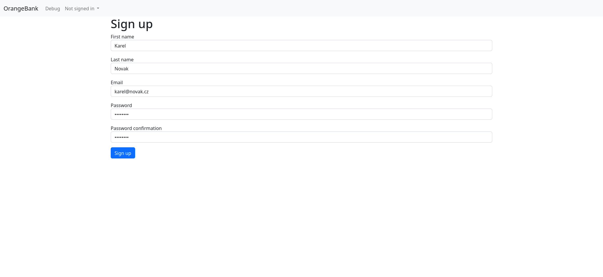
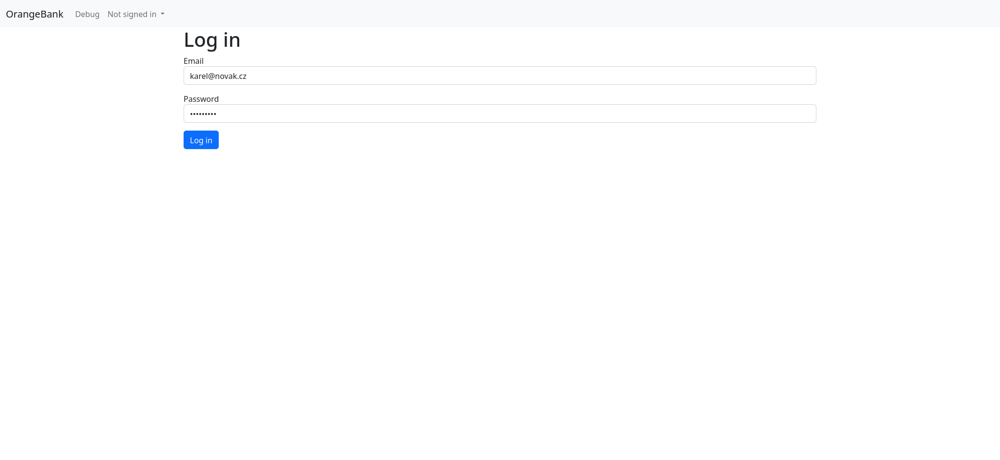
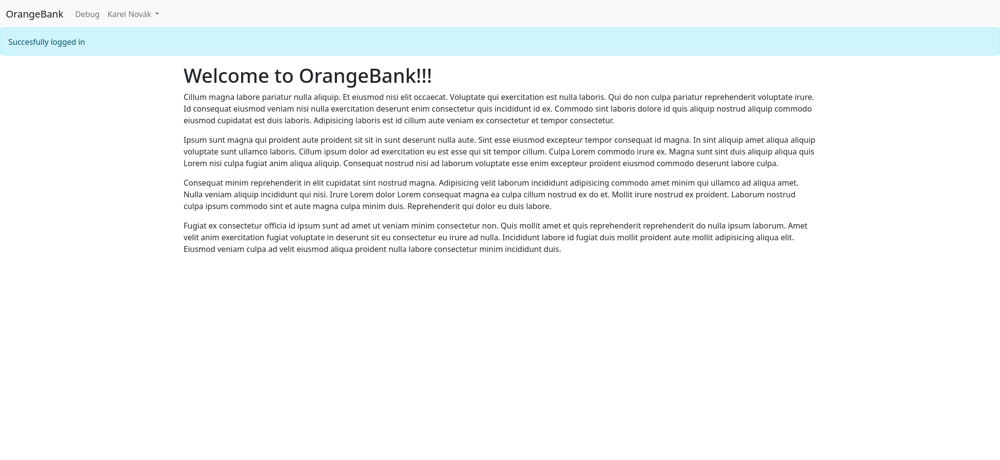
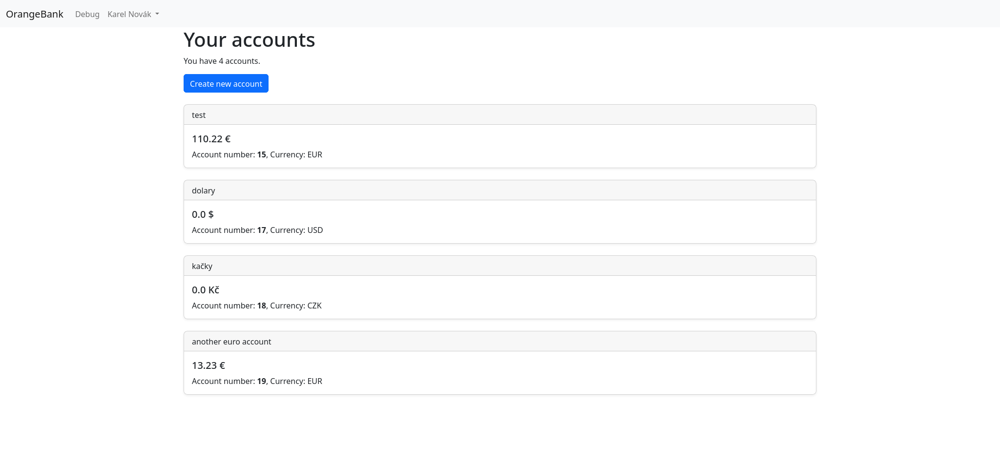
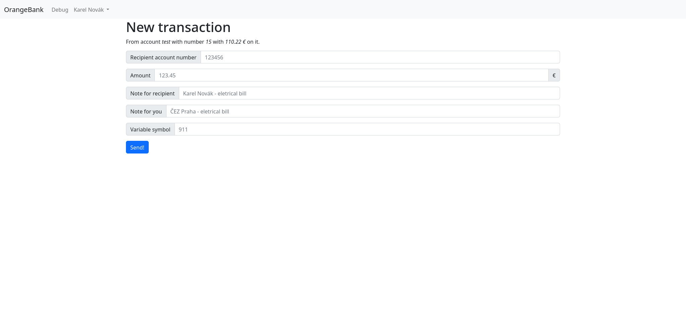
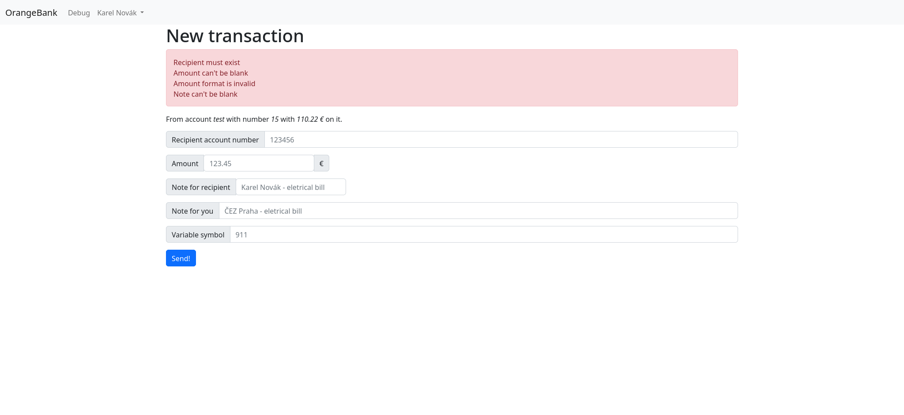

# OrangeBank
This is a project, which on I would like to dive into RoR deeply. These are things I have already done:

1. You can create an user account on sing_up path. I use digest gem to validate and hash password.

2. When are registred, you can log in.

3. After you are logged in, you can see your name on navbar with drowpdown menu.

4. After selecting "My accounts" on dropdown menu, you can see all your bank accounts and info about them.

5. You can make a new transaction with this easy-to-use form.

6. All transaction as well as all user accounts and bank accounts are varified before they are saved.
